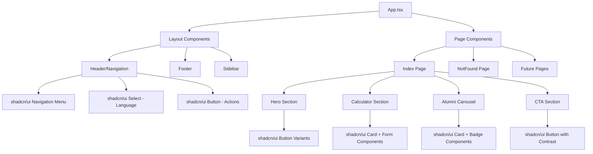

# Design Document

## Overview

This design outlines a comprehensive UI overhaul for the CareerPathak application to achieve consistent shadcn/ui component usage throughout the interface while implementing high-contrast button styling and improved visual hierarchy. The current application already has a solid foundation with shadcn/ui components and a well-structured design system, but requires systematic improvements for consistency, accessibility, and enhanced user experience.

The design maintains the existing brand identity (education blue, success green, Kashmir saffron) while leveraging shadcn/ui's component architecture for better maintainability and user experience.

## Architecture

### Component Architecture



### Design System Integration

The application will use a layered approach:
1. **Base Layer**: shadcn/ui components with default styling
2. **Theme Layer**: Custom CSS variables for brand colors and design tokens
3. **Component Layer**: Enhanced shadcn/ui components with brand-specific variants
4. **Utility Layer**: Custom utility classes for specific use cases

## Components and Interfaces

### Enhanced Button System

#### Button Variant Strategy
```typescript
// Extended button variants for high contrast
const enhancedButtonVariants = {
  // Primary actions - High contrast blue
  primary: "bg-primary text-primary-foreground hover:bg-primary-hover shadow-primary",
  
  // Secondary actions - Success green
  secondary: "bg-secondary text-secondary-foreground hover:bg-secondary-hover shadow-custom-md",
  
  // Accent actions - Kashmir saffron for CTAs
  accent: "bg-accent text-accent-foreground hover:bg-accent-hover shadow-accent",
  
  // Destructive actions - High contrast red
  destructive: "bg-destructive text-destructive-foreground hover:bg-destructive/90",
  
  // Outline variants with enhanced contrast
  outline: "border-2 border-primary text-primary hover:bg-primary hover:text-primary-foreground",
  "outline-secondary": "border-2 border-secondary text-secondary hover:bg-secondary hover:text-secondary-foreground",
  
  // Ghost variants for subtle actions
  ghost: "hover:bg-muted hover:text-foreground",
  
  // Link style for navigation
  link: "text-primary underline-offset-4 hover:underline hover:text-primary-hover"
}
```

#### Button Usage Guidelines
- **Primary**: Main actions (Start Quiz, Submit Forms)
- **Secondary**: Supporting actions (Explore, Learn More)  
- **Accent**: High-impact CTAs (Join Now, Get Started)
- **Outline**: Alternative actions in button groups
- **Ghost**: Subtle actions in dense interfaces
- **Destructive**: Delete, Remove, Cancel actions

### Layout Components

#### Header Component
```typescript
interface HeaderProps {
  currentLanguage: string;
  onLanguageChange: (language: string) => void;
}
```

Uses:
- `NavigationMenu` for main navigation
- `Select` for language switching with enhanced styling
- `Button` variants for action items
- `Separator` for visual organization

#### Card System Enhancement
```typescript
interface EnhancedCardProps extends CardProps {
  variant?: 'default' | 'gradient' | 'interactive' | 'elevated';
  hover?: boolean;
}
```

Card variants:
- **Default**: Standard shadcn/ui card
- **Gradient**: Subtle gradient background for featured content
- **Interactive**: Hover effects and cursor pointer for clickable cards
- **Elevated**: Enhanced shadow for important content

### Form Components

#### Enhanced Form Controls
All form elements will use shadcn/ui components with consistent styling:

- `Input` with proper focus states and validation
- `Select` with custom styling matching the theme
- `Slider` with brand-colored tracks and thumbs
- `Label` with consistent typography
- `Button` for form actions with appropriate variants

#### Form Validation Integration
```typescript
interface FormFieldProps {
  label: string;
  error?: string;
  required?: boolean;
  helpText?: string;
}
```

Uses `Alert` component for validation messages with appropriate variants.

### Interactive Elements

#### Alumni Carousel Enhancement
- Replace custom carousel with `Carousel` component from shadcn/ui
- Use `Card` components for alumni profiles
- Implement `Badge` components for achievements and details
- Add `Button` navigation controls with proper contrast

#### Calculator Component
- Wrap in enhanced `Card` component
- Use `Slider` components with custom styling
- Display results in `Alert` or highlighted `Card`
- Use `Badge` components for comparison metrics

## Data Models

### Theme Configuration
```typescript
interface ThemeConfig {
  colors: {
    primary: ColorScale;
    secondary: ColorScale;
    accent: ColorScale;
    success: ColorScale;
    warning: ColorScale;
    destructive: ColorScale;
  };
  components: {
    button: ButtonThemeConfig;
    card: CardThemeConfig;
    form: FormThemeConfig;
  };
}

interface ColorScale {
  50: string;
  100: string;
  // ... through 900
  DEFAULT: string;
  foreground: string;
}
```

### Component Props Extensions
```typescript
interface ComponentVariantProps {
  variant?: string;
  size?: 'sm' | 'md' | 'lg' | 'xl';
  contrast?: 'low' | 'medium' | 'high';
}
```

## Error Handling

### Component Error Boundaries
- Implement error boundaries around major component sections
- Use `Alert` component for user-facing error messages
- Provide fallback UI using shadcn/ui components

### Form Validation
- Use `react-hook-form` with shadcn/ui form components
- Display validation errors using `Alert` variants
- Implement real-time validation feedback with appropriate styling

### Loading States
- Use `Skeleton` components for loading states
- Implement `Spinner` or `Progress` components for async operations
- Provide consistent loading UX across all components

## Testing Strategy

### Component Testing
1. **Unit Tests**: Test individual shadcn/ui component integrations
2. **Visual Regression Tests**: Ensure consistent styling across components
3. **Accessibility Tests**: Verify WCAG compliance with enhanced contrast
4. **Interaction Tests**: Test button states, form validation, and user flows

### Testing Approach
```typescript
// Example test structure
describe('Enhanced Button Component', () => {
  it('renders primary variant with high contrast', () => {
    // Test primary button styling and accessibility
  });
  
  it('provides proper focus management', () => {
    // Test keyboard navigation and focus states
  });
  
  it('maintains contrast ratios', () => {
    // Test color contrast meets WCAG standards
  });
});
```

### Accessibility Testing
- Color contrast validation for all button variants
- Keyboard navigation testing
- Screen reader compatibility
- Focus management verification

## Implementation Phases

### Phase 1: Core Component Enhancement
- Enhance button variants with high contrast colors
- Update card components with new variants
- Implement consistent spacing and typography

### Phase 2: Layout and Navigation
- Update header with shadcn/ui navigation components
- Enhance footer with proper component usage
- Implement responsive layout improvements

### Phase 3: Interactive Elements
- Replace custom carousel with shadcn/ui carousel
- Enhance calculator with proper form components
- Update all form elements to use shadcn/ui components

### Phase 4: Polish and Optimization
- Fine-tune animations and transitions
- Optimize component performance
- Conduct accessibility audit and improvements

## Design Decisions and Rationales

### Button Contrast Strategy
**Decision**: Implement high-contrast button variants with distinct visual hierarchy
**Rationale**: Improves accessibility, user experience, and visual clarity while maintaining brand identity

### Component Consistency
**Decision**: Use shadcn/ui components exclusively throughout the application
**Rationale**: Ensures consistent behavior, styling, and maintenance while leveraging community-tested components

### Theme Integration
**Decision**: Maintain existing color scheme while enhancing contrast and usability
**Rationale**: Preserves brand identity while improving user experience and accessibility compliance

### Responsive Design
**Decision**: Leverage shadcn/ui's responsive utilities and components
**Rationale**: Ensures consistent responsive behavior across all components and devices

This design provides a comprehensive roadmap for transforming the CareerPathak application into a fully consistent shadcn/ui implementation with enhanced visual hierarchy and accessibility.